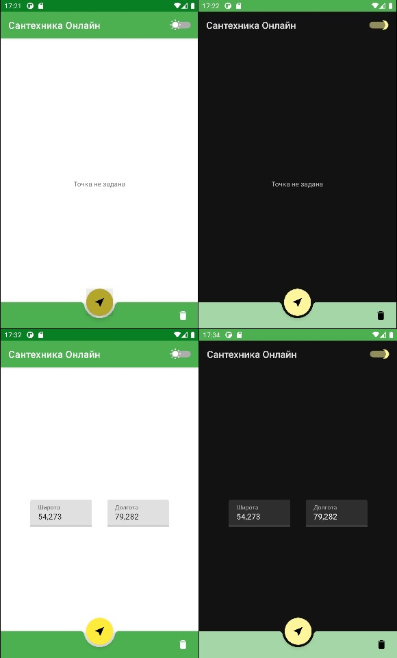
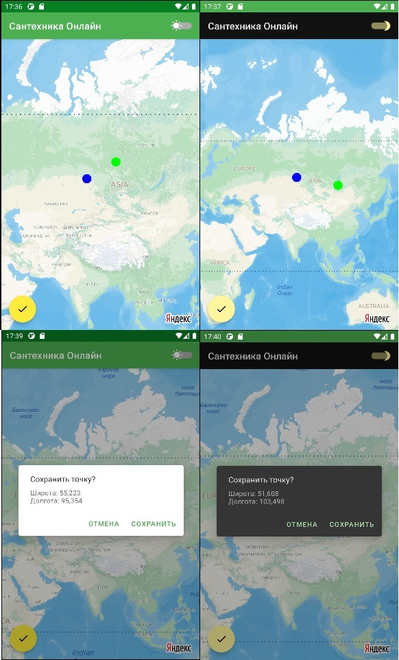

# О приложении
Тестовое задание комнании [ООО "Сантехника-Онлайн"](https://santehnika-online.ru/) на позицию Junior Android Developer
---

# Возможности приложения
### 1. Главный экран
- на главнм экране отображаются координаты сохраненной точки
- если ранее точка не была сохранена, то отображается замещающий текст "Точка не задана"
- в правом нижнем углу главного расположена кнопка удаления точки
- в правом верхнем углу расположен переключатель светлой/темной темы
- над нижним баром расположжена кнопка перехода на экран с картой

### 2. Экран с картой
- на экане с картой отображается ранее сохраненная точка (синим цветом)
- для создания новой точки используется длинный клик в нужной области карты
- новая точка отображается зеленым цветом
- в нижнем левом углу экрана расположена кнопка сохранения
- если новая точка на карте была создана, после нажатия на кнопку сохранения отображается экран подтверждения сохранения с координатами новой точки

---
# Используемые технологии
- Kotlin + Coroutines
- MVVM + Single Activity
- SharedPreferences
- StateFlow
- Jetpack Navigation
- Hilt
- Gson
- Yandex MapKit
- Material IO Components